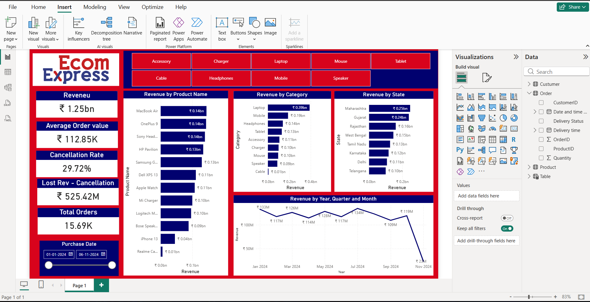
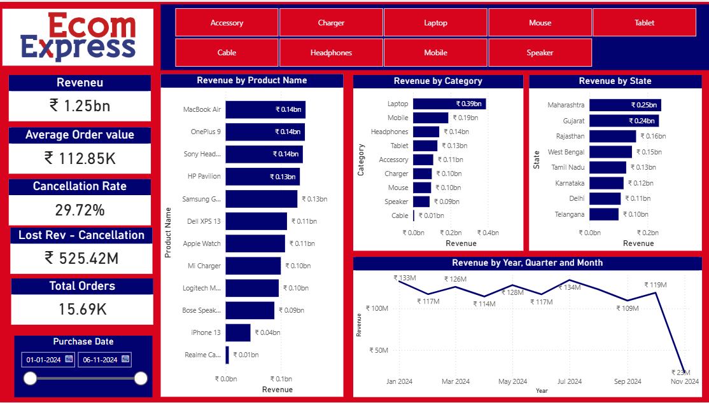
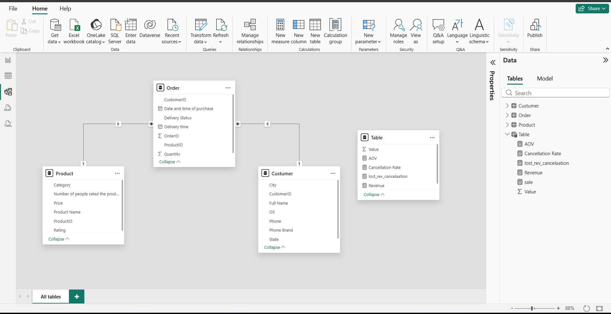
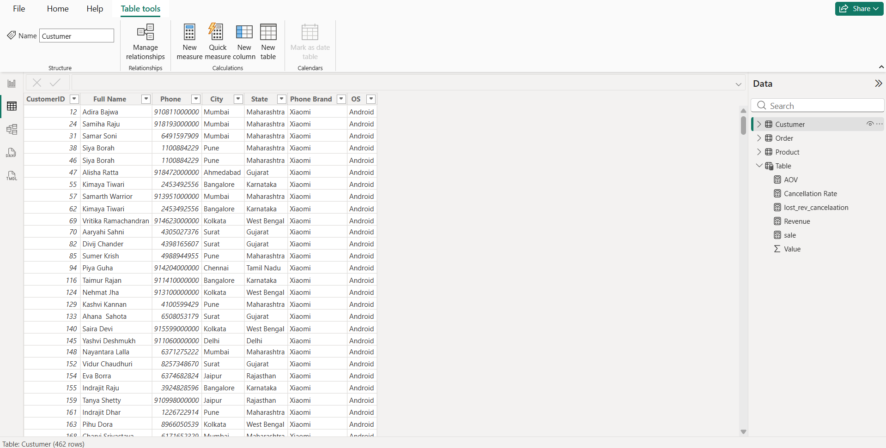

# 📊 Ecom Express Sales Dashboard | Power BI




---

# 📌 Project Overview

The **Ecom Express Sales Dashboard** is an interactive Business Intelligence dashboard developed using **Microsoft Power BI**.

The dashboard provides actionable insights into:

- Revenue Performance
- Product Performance
- Customer Orders
- State-wise Sales
- Cancellation Analysis
- Revenue Trends

using interactive visuals, DAX measures, KPIs, and slicers.

---

# 🎯 Project Objectives

- Analyze overall sales performance.
- Monitor Revenue and Total Orders.
- Track Average Order Value.
- Measure Cancellation Rate.
- Identify Lost Revenue due to cancelled orders.
- Compare Revenue across States.
- Analyze Product-wise Revenue.
- Monitor Monthly Revenue Trend.

---

# 📈 Key Performance Indicators (KPIs)

| KPI | Value |
|------|------:|
| 💰 Revenue | ₹1.25 Billion |
| 📦 Total Orders | 15.69K |
| 💳 Average Order Value | ₹112.85K |
| ❌ Cancellation Rate | 29.72% |
| 📉 Lost Revenue | ₹525.42 Million |

---

# 🖼 Dashboard Preview

## Main Dashboard


---

## Dashboard UI



---

## Data Model



---

## Customer Table



---

# 📊 Dashboard Features

- Revenue KPI
- Average Order Value
- Total Orders
- Cancellation Rate
- Lost Revenue
- Revenue by Product Name
- Revenue by Product Category
- Revenue by State
- Monthly Revenue Trend
- Product Category Filter
- Purchase Date Filter

---

# 📂 Dataset Information

This project uses **three datasets**.

## Customer

- CustomerID
- Full Name
- Phone
- City
- State
- Phone Brand
- Operating System

---

## Orders

- OrderID
- CustomerID
- ProductID
- Quantity
- Purchase Date
- Delivery Time
- Delivery Status

---

## Product

- ProductID
- Product Name
- Category
- Price
- Rating

---

# 🏗 Data Model

The dashboard follows a **Star Schema**.

```text
             Customer
                 |
                 |
                 |
Orders ---------------- Product
```

Relationship Type

- Customer → Orders (1 : Many)
- Product → Orders (1 : Many)

---

# 🧮 DAX Measures

### Revenue

```DAX
Revenue =
SUMX(
    Orders,
    Orders[Quantity] * RELATED(Product[Price])
)
```

### Average Order Value

```DAX
AOV =
DIVIDE([Revenue], COUNTROWS(Orders))
```

### Cancellation Rate

```DAX
Cancellation Rate =
DIVIDE(
    CALCULATE(
        COUNTROWS(Orders),
        Orders[Delivery Status] = "Cancelled"
    ),
    COUNTROWS(Orders)
)
```

### Lost Revenue

```DAX
Lost Revenue =
CALCULATE(
    [Revenue],
    Orders[Delivery Status] = "Cancelled"
)
```

### Total Orders

```DAX
Total Orders =
COUNTROWS(Orders)
```

---

# 📈 Business Insights

- 💻 Laptop category generated the highest revenue.
- 📱 Mobile category ranked second.
- 💰 MacBook Air generated the highest revenue among products.
- 🌍 Maharashtra recorded the highest revenue.
- 📉 Cancellation Rate reached **29.72%**.
- 💸 Lost Revenue exceeded **₹525 Million**.
- 📊 Revenue peaked around **July 2024**.

---

# 🛠 Technologies Used

- Microsoft Power BI
- Power Query
- DAX
- Data Modeling
- CSV Dataset
- Microsoft Excel

---

# 💡 Skills Demonstrated

- Data Cleaning
- Data Transformation
- Power Query
- DAX
- Data Modeling
- KPI Development
- Dashboard Design
- Business Intelligence
- Data Visualization
- Analytical Thinking

---

# 📁 Repository Structure

```text
Ecom-Express-Sales-Dashboard-PowerBI/
│
├── Dashboard/
│   └── Ecom_Express_Sales_Dashboard.pbix
│
├── Dataset/
│   ├── Customers.csv
│   ├── Orders.csv
│   └── Products.csv
│
├── Images/
│   ├── Dashboard.png
│   ├── Dashboard_Main.png
│   ├── Model_View.png
│   ├── Customer_Table.png
│   └── Logo.png
│
├── Documentation/
│   ├── Project_Report.docx
│   └── Data_Dictionary.docx
│
├── Presentation/
│   └── Ecom_Express_Dashboard_Presentation.pptx
│
├── README.md
├── LICENSE
└── .gitignore
```

---

# 🚀 How to Use

1. Clone this repository.

```bash
git clone https://github.com/YOUR_USERNAME/Ecom-Express-Sales-Dashboard-PowerBI.git
```

2. Open the `.pbix` file using **Power BI Desktop**.
3. Refresh the data if required.
4. Explore the interactive dashboard.

---

# 🔮 Future Enhancements

- Sales Forecasting
- Customer Segmentation
- Profit Analysis
- Regional Heat Maps
- Dynamic Tooltips
- Drill-through Reports
- Customer Lifetime Value Analysis

---

# 👨‍💻 Author

**Hrishikesh Kshirsagar**

🎓 B.E. in Artificial Intelligence & Data Science

### Skills

- Power BI
- SQL
- Python
- Data Analytics
- Machine Learning

---

## ⭐ Support

If you found this project helpful:

⭐ Star this repository

🍴 Fork the repository

📢 Share it with others

---

## 📬 Contact

Feel free to connect for discussions related to:

- Power BI
- SQL
- Python
- Data Analytics
- Business Intelligence

**LinkedIn:** *(Add your LinkedIn profile link here)*

**GitHub:** *(Add your GitHub profile link here)*
